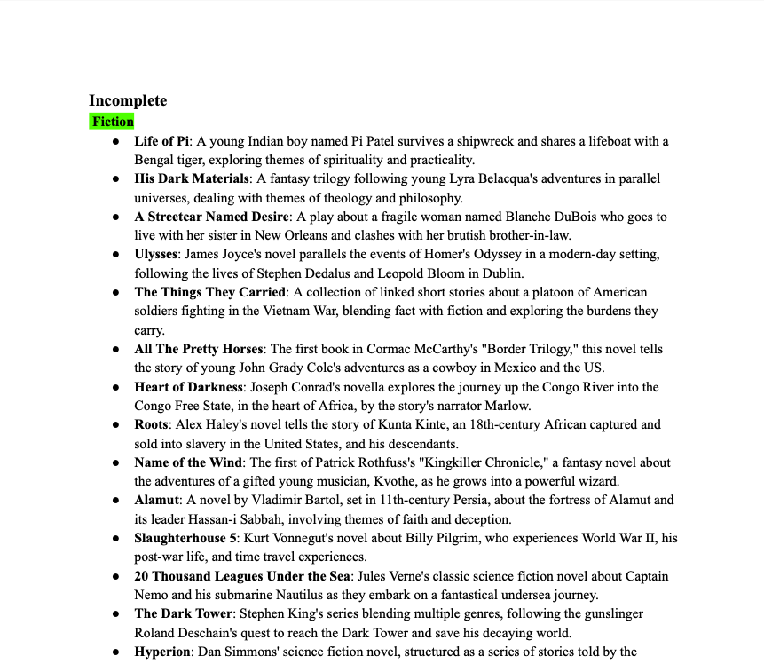
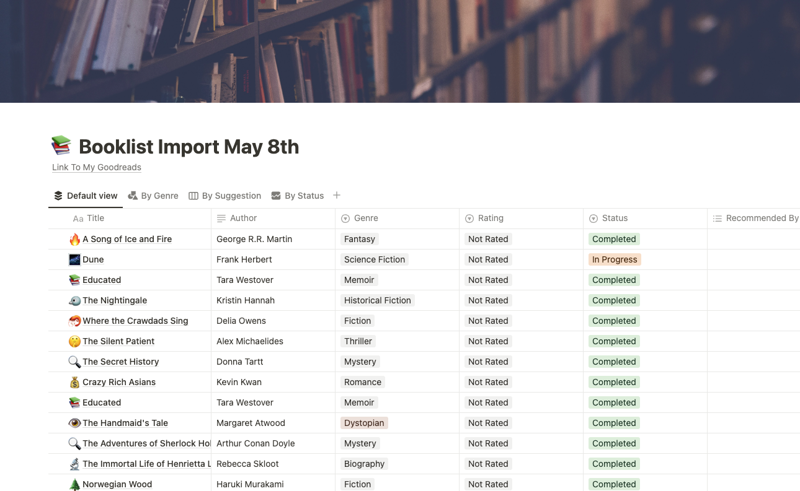

<div align="center">
    
</div>

# BookBridge - Booklist Import Tool

# Booklist Import Tool

Transform your old booklists into a dynamic Notion database with the Booklist Import Tool.  Organize, share, and rediscover your reading history with the help of cutting-edge language models.

## Background and Overview

As an avid reader, I've accumulated a substantial list of books over the years, categorizing them by what I wanted to read, what I had completed, and the type of books they are. With an intention to share my reading journey more publicly and to organize my collection with greater sophistication, I've chosen Notion as the platform for its unparalleled ability to present, store, and share information. On top of being a pleasure to look at, Notion pages are easy to share, publish, modify, and update, and has robust API support for people with more technical inclination. Not sponsored, btw. 

## Screenshots

### Before Import

Original booklist in PDF format prior to using the Booklist Import Tool, lacking Notion's interactive features.

<div align="center">
    
</div>

### After Import to Notion

Transformed into a dynamic Notion database, offering categorization, tagging, and reading status updates for a richer reading management experience.

<div align="center">
    
</div>


## Installation

To get started with BookBridge, follow these simple installation instructions.

### Prerequisites

- Python 3.7 or higher
- Pip (Python package installer)

### Steps

1. Clone this repository to your local machine using:
   ```
   git clone https://github.com/yourusername/bookbridge.git
   ```
2. Navigate to the cloned directory:
   ```
   cd bookbridge
   ```
3. Create a virtual environment in the current directory by running:
   ```
   # For macOS and Linux:
   python3 -m venv venv

   # For Windows:
   python -m venv venv
   ```
   This will create a new directory named `venv` in your project directory, containing the virtual environment. It's a good practice to use a virtual environment for Python projects to manage dependencies separately for each project and avoid conflicts between project requirements.

4. Activate the virtual environment:
   ```
   # For macOS and Linux:
   source venv/bin/activate

   # For Windows:
   .\venv\Scripts\activate
   ```
   Once activated, your terminal should show the name of the virtual environment (in this case, `venv`), indicating that any Python or pip commands will now use the virtual environment's Python interpreter and installed packages.

5. It's a good practice to ensure that pip, setuptools, and wheel are up to date within the virtual environment:
   ```
   pip install --upgrade pip setuptools wheel
   ```

6. Install the required dependencies:
   ```
   pip install -r requirements.txt
   ```
   This will install all the necessary packages specified in the `requirements.txt` file into the virtual environment.

By following these steps, users will set up a virtual environment for the project, ensuring that all dependencies are installed l


1. Clone this repository to your local machine using:
   ```
   git clone https://github.com/yourusername/bookbridge.git
   ```
2. Navigate to the cloned directory:
   ```
   cd bookbridge
   ```
- upgrade pip if you haven't already 

3. Install the required dependencies:
   ```
   pip install -r requirements.txt
   ```

## Usage

To use BookBridge to import your booklist into a Notion database, follow these steps:

1. Obtain an integration token from Notion by creating a new integration. Make sure your Notion page has given access to the integration. 
2. Obtain an API key from OpenAI to use LLMs. This iteration uses `gpt-4o`. 
3. Obtain the URL of the Notion page you want to import the booklist into. If you're new to Notion, the [getting started](https://www.notion.so/help/category/new-to-notion) page is a good place to begin.
4. Run the tool using the command:
   ```
   python bookbridge.py
   ```
5. Input the required information in the interface and click "Run Script". If you entered the information correctly, you should see a new database under the page you specified in a few seconds! 


## Contributing

Contributions are what make the open source community such an amazing place to learn, inspire, and create. Any contributions you make are **greatly appreciated**.

1. Fork the Project
2. Create your Feature Branch (`git checkout -b feature/AmazingFeature`)
3. Commit your Changes (`git commit -m 'Add some AmazingFeature'`)
4. Push to the Branch (`git push origin feature/AmazingFeature`)
5. Open a Pull Request

## License

Distributed under the MIT License. See `LICENSE` for more information.

## Contact

K. Simon Chuang - keenlyschuang@gmail.com

Project Link: [https://github.com/keenlychuang/bookbridge](https://github.com/keenlychuang/bookbridge)
